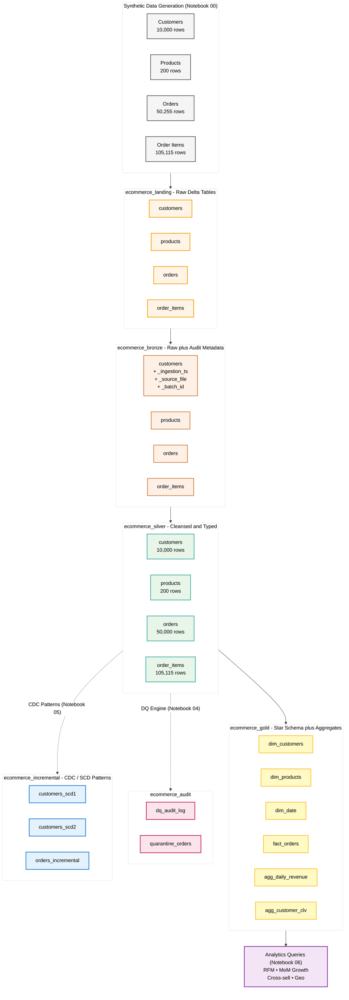
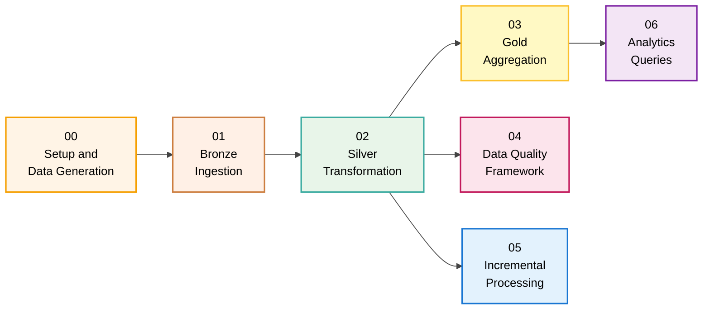
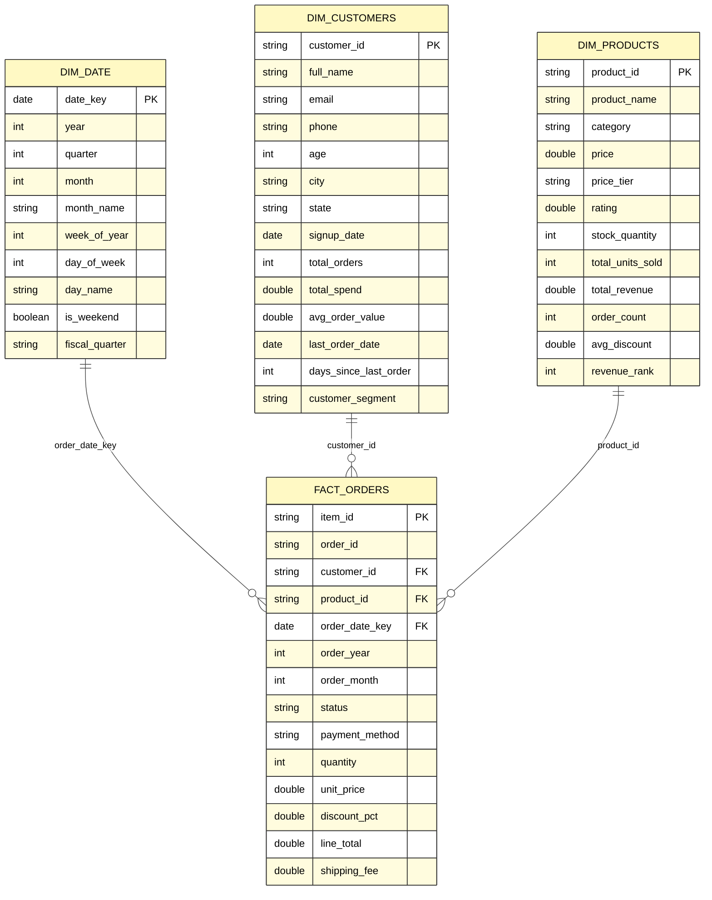
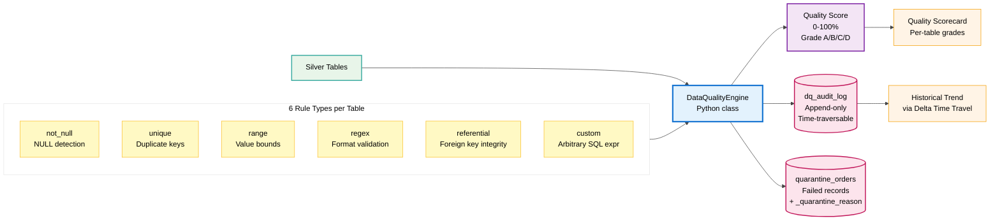

# E-Commerce Data Lakehouse Pipeline

> An end-to-end data engineering project on **Databricks Free Edition (Serverless)** demonstrating production-grade lakehouse patterns: **Medallion Architecture**, **Delta Lake**, **PySpark**, **Star Schema modeling**, **CDC/SCD patterns**, and a reusable **Data Quality framework**.

[](https://spark.apache.org/)
[](https://delta.io/)
[](https://databricks.com/)
[](https://spark.apache.org/docs/latest/api/python/)
[](https://www.python.org/)
[](https://spark.apache.org/sql/)
[](LICENSE)

---

## Table of Contents

- [Overview](#overview)
- [Key Highlights](#key-highlights)
- [Architecture](#architecture)
- [Pipeline Flow](#pipeline-flow)
- [Star Schema (Gold Layer)](#star-schema-gold-layer)
- [Data Quality Framework](#data-quality-framework)
- [Tech Stack](#tech-stack)
- [Data Volumes](#data-volumes)
- [Project Structure](#project-structure)
- [Quick Start](#quick-start)
- [Notebook Walkthrough](#notebook-walkthrough)
- [Skills & Concepts Demonstrated](#skills--concepts-demonstrated)
- [Sample Analytics](#sample-analytics)
- [Architecture Decisions](#architecture-decisions)
- [Future Enhancements](#future-enhancements)
- [License](#license)
- [Author](#author)

---

## Overview

This project simulates a **real-world e-commerce data platform**, ingesting raw transactional data and progressively refining it through **Bronze → Silver → Gold** layers into business-ready analytics. It mirrors how modern data platforms are built at companies like Uber, Airbnb, Netflix, and Shopify — using the **lakehouse pattern** (combining the flexibility of data lakes with the reliability of data warehouses).

**Why this matters:** rather than just SQL queries on a static dataset, this project demonstrates the full data engineering lifecycle — generating realistic synthetic data, building idempotent pipelines, validating data quality, handling incremental updates with CDC patterns, and modeling for analytics consumption.

---

## Key Highlights

- **23 Delta tables** organized across **6 schemas** following the Medallion Architecture
- **165,000+ rows** of synthetic data spanning 12 months of e-commerce activity (10K customers, 200 products, 50K orders, 105K line items)
- **Reusable Data Quality engine** with 6 rule types (null, unique, range, regex, referential integrity, custom expressions), automated scoring, audit logging, and quarantine
- **Production CDC patterns**: SCD Type 1 (overwrite), SCD Type 2 (history tracking), append-only with watermarks, idempotent MERGE
- **Delta Lake features**: ACID transactions, time travel, schema evolution, OPTIMIZE/Z-ORDER, VACUUM
- **Star Schema** (3 dimensions + 1 fact + 2 aggregates) optimized with partitioning and Z-ordering
- **10+ business analytics queries** including RFM segmentation, month-over-month growth, product cross-sell, geographic performance
- **Idempotent pipelines** safe for re-execution without data corruption
- **Serverless-compatible** code (no `dbutils.fs`, no `cache()`, no path-based loading)

---

## Architecture

The pipeline follows the **Medallion Architecture** — a layered design where each layer has a specific role and quality contract:



### Layer responsibilities

| Layer | Purpose | Quality Contract |
|-------|---------|------------------|
| **Landing** | Raw source data, never modified after write | Schema-on-read, source of truth |
| **Bronze** | Lossless copy + audit metadata (`_ingestion_timestamp`, `_source_file`, `_batch_id`) | No filtering, no transformation, fully replayable |
| **Silver** | Cleansed, deduplicated, type-cast, validated | Business keys unique, referential integrity holds |
| **Gold** | Business-ready dimensional model (star schema) + pre-aggregated KPIs | Optimized for BI queries, low query latency |
| **Audit** | DQ scores, quality history, quarantined records | Append-only, time-traversable |
| **Incremental** | CDC demo tables: SCD1, SCD2, append-only watermark | Idempotent, audit-friendly |

---

## Pipeline Flow

End-to-end execution sequence across the 7 notebooks:



Each notebook is **self-contained** and **idempotent** — it reads from persisted Delta tables and writes to new ones. You can re-run any notebook independently without rebuilding upstream layers.

---

## Star Schema (Gold Layer)

The Gold layer is modeled as a classic **star schema** — one fact table at the center, joined to multiple denormalized dimension tables. This design is optimized for analytical queries and supported natively by every BI tool (Power BI, Tableau, Looker, etc.).



**Grain of `fact_orders`:** one row per **order line item** (not per order). This grain enables product-level analysis (e.g., "which products are bought together?") that an order-level grain cannot answer.

**Aggregate tables** (pre-computed for fast dashboard queries):
- `agg_daily_revenue` — daily revenue with 7-day rolling average
- `agg_customer_clv` — customer lifetime value with tiering (High/Medium/Low)

---

## Data Quality Framework

A reusable, configurable quality engine inspired by tools like **Great Expectations** and **Databricks Lakehouse Monitoring**:



**Example rules:**

```python
customer_rules = [
    DataQualityRule("customer_id_not_null", "not_null", "customer_id", severity="error"),
    DataQualityRule("customer_id_unique", "unique", "customer_id", severity="error"),
    DataQualityRule("email_format", "regex", "email",
                    condition=r"^[\w\.\-]+@[\w\.\-]+\.\w+$", severity="warning"),
    DataQualityRule("age_range", "range", "age",
                    condition="age BETWEEN 13 AND 120", severity="warning"),
]
```

The engine produces:
- **Per-rule pass rate** (e.g., `customer_id_unique: 100% (0 failures)`)
- **Per-table quality score** weighted by error-severity rules
- **Audit log row** for every check, written to `ecommerce_audit.dq_audit_log`
- **Quarantine table** for rows that fail error-severity rules

---

## Tech Stack

| Technology | Purpose |
|------------|---------|
| **Apache Spark 3.5+ (PySpark)** | Distributed data processing |
| **Delta Lake 3.x** | ACID transactions, time travel, schema enforcement, MERGE |
| **Spark SQL** | Analytics on Gold layer (10+ queries) |
| **Python 3.12** | Data generation, pipeline orchestration, DQ engine |
| **Databricks Free Edition (Serverless)** | Notebook environment + cluster |
| **Unity Catalog (`hive_metastore`)** | Managed table catalog |

---

## Data Volumes

| Object | Count | Generated by |
|--------|-------|--------------|
| Customers (15 cities, 25 first names, 16 last names) | 10,000 | Faker-style synthetic data |
| Products (8 categories, 40 product types) | 200 | Catalog generator |
| Orders (12 months of 2025) | 50,000 base + 255 dupes = **50,255** | Random distribution |
| Order line items (1–5 items per order) | **105,115** | Weighted choice |
| Delta tables across all schemas | **23** | Pipeline output |
| Lines of code (notebooks) | ~1,800 | All 7 notebooks combined |

> The 0.5% intentional duplicate rate in `orders` is **by design** — it lets Notebook 02 demonstrate window-function deduplication (`ROW_NUMBER() OVER (PARTITION BY order_id ORDER BY _ingestion_timestamp DESC)`).

---

## Project Structure

```text
ecommerce-data-lakehouse/
├── README.md                                # You are here
├── LICENSE                                  # MIT
├── .gitignore                               # OneDrive/Python/IDE artifacts
│
├── notebooks/
│   ├── 00_setup_and_data_generation.py      # Schema setup + 165K rows of synthetic data
│   ├── 01_bronze_ingestion.py               # Landing → Bronze (with audit metadata)
│   ├── 02_silver_transformation.py          # Bronze → Silver (cleanse, dedup, type-cast)
│   ├── 03_gold_aggregation.py               # Silver → Gold (star schema + aggregates)
│   ├── 04_data_quality_framework.py         # Reusable DQ engine + audit log
│   ├── 05_incremental_processing.py         # CDC: SCD1, SCD2, watermark, time travel
│   └── 06_analytics_queries.py              # 10+ business analytics queries
│
└── docs/
    ├── instructions.md                      # GitHub publishing & resume integration guide
    └── resume_bullet_points.md              # Ready-to-paste resume bullets + interview Q&A
```

---

## Quick Start

### Prerequisites

- A free [Databricks account](https://databricks.com/try-databricks) (Free Edition)
- A web browser

### Step 1 — Sign up for Databricks Free Edition

1. Go to [databricks.com/try-databricks](https://databricks.com/try-databricks).
2. Sign up with your email — choose **"Free Edition"** when prompted.
3. Wait for your workspace to provision (~2 min).

### Step 2 — Import the notebooks

**Option A — Via GitHub Repo (recommended):**
1. In Databricks, navigate to **Workspace → Repos → Add Repo**.
2. Paste this repo's URL.
3. Click **Create Repo**.

**Option B — Manual upload:**
1. Download the `.py` files from the `notebooks/` folder.
2. In Databricks, **Workspace → Users → your email → Import**.
3. Upload each `.py` file.

### Step 3 — Run the notebooks in order

| Step | Notebook | ~Runtime |
|------|----------|----------|
| 1 | `00_setup_and_data_generation` | 90 s |
| 2 | `01_bronze_ingestion` | 30 s |
| 3 | `02_silver_transformation` | 60 s |
| 4 | `03_gold_aggregation` | 90 s |
| 5 | `04_data_quality_framework` | 60 s |
| 6 | `05_incremental_processing` | 90 s |
| 7 | `06_analytics_queries` | 30 s |

**Total wall-clock time:** ~7–8 minutes on serverless compute.

> **Important:** All notebooks use **managed tables** in the `hive_metastore` catalog. No DBFS mounts, no `dbutils.fs`, no path-based loads. This makes them fully compatible with Databricks Free Edition Serverless.

### Step 4 — Verify the output

Run this in any notebook cell:

```sql
%sql
SELECT 'silver' AS layer, COUNT(*) AS tables FROM (SHOW TABLES IN ecommerce_silver) UNION ALL
SELECT 'gold', COUNT(*) FROM (SHOW TABLES IN ecommerce_gold);
```

Or query a sample analytics result:

```sql
%sql
SELECT customer_segment, COUNT(*) AS customers, ROUND(AVG(total_spend), 0) AS avg_spend
FROM ecommerce_gold.dim_customers
GROUP BY customer_segment
ORDER BY avg_spend DESC;
```

---

## Notebook Walkthrough

### `00 — Setup & Data Generation`

Creates the 6 Unity Catalog schemas and generates realistic synthetic e-commerce data:
- 10,000 customers across 15 Indian cities (Mumbai, Delhi, Bangalore, etc.)
- 200 products across 8 categories (Electronics, Clothing, Books, etc.)
- 50,000 orders + ~250 intentional duplicates
- 105,000+ order line items with realistic quantity/price distributions

**Techniques:** `random.seed(42)` for reproducibility, weighted `random.choices()` for realistic distributions, `spark.createDataFrame()` with explicit schemas.

### `01 — Bronze Ingestion`

Reads from `ecommerce_landing.*` and writes to `ecommerce_bronze.*` with three audit columns:
- `_ingestion_timestamp` — when the row landed in Bronze
- `_source_file` — origin (e.g., `ecommerce_landing.customers`)
- `_batch_id` — UUID for traceability

**Principle:** schema-on-read, no transformation. Bronze is fully replayable.

### `02 — Silver Transformation`

Applies cleansing rules:
- **Deduplication** via `ROW_NUMBER() OVER (PARTITION BY business_key ORDER BY _ingestion_timestamp DESC)` — recovers 50,000 unique orders from 50,255 raw rows
- **Type casting** — string dates → `DateType`, status → standardized lowercase
- **Standardization** — `INITCAP` for names/cities, `LOWER(TRIM())` for emails
- **Derived columns** — `full_name`, `price_tier` (using `CASE WHEN` over price ranges)
- **Audit metadata** — `_silver_timestamp`

### `03 — Gold Aggregation`

Builds the **star schema**:
- **Dimensions:** `dim_customers`, `dim_products`, `dim_date` (full 2025 calendar)
- **Fact:** `fact_orders` (grain = one line item, partitioned by `order_year`, `order_month`)
- **Aggregates:**
  - `agg_daily_revenue` — daily revenue + 7-day rolling average via `AVG() OVER (rowsBetween(-6, 0))`
  - `agg_customer_clv` — Customer Lifetime Value with frequency-based scoring

**Optimizations:** `OPTIMIZE` + `ZORDER BY (city, customer_segment)` on dimensions; partitioning on fact table for date-range queries.

### `04 — Data Quality Framework`

A class-based engine (`DataQualityRule`, `DataQualityEngine`) that:
1. Defines validation rules per table (6 rule types).
2. Runs all checks and captures pass/fail counts.
3. Computes a **weighted quality score** (errors only, ignores warnings).
4. Writes results to `ecommerce_audit.dq_audit_log` (append-only).
5. Produces a **quarantine table** for rows that fail any error-severity rule.

**Why this matters:** decouples DQ logic from pipeline code. New rules can be added by appending to a list; no engine changes required.

### `05 — Incremental Processing`

Demonstrates four production CDC patterns:

| Pattern | Use case | Example |
|---------|----------|---------|
| **SCD Type 1** | Overwrite latest values | Customer email change — only current value matters |
| **SCD Type 2** | Track history | Customer address change — keep all versions with `effective_start`/`effective_end` |
| **Append-only with watermark** | Fact tables | New orders — never update old facts |
| **Idempotent MERGE** | Re-runnable upsert | Same input → same output, no duplicates |

**Bonus:** Delta Lake **time travel** queries showing version 0 vs version 1 of `customers_scd1` after MERGE.

### `06 — Analytics Queries`

Ten business-ready SQL queries on the Gold layer:
1. Monthly revenue trend
2. Revenue by category & price tier
3. RFM customer segmentation (Champions / Loyal / At-Risk / Lost)
4. Payment method analysis with cancellation rates
5. Geographic performance (top cities)
6. Day-of-week ordering patterns
7. Top 10 products by revenue
8. Customer Lifetime Value distribution
9. Month-over-month growth percentage
10. Product category cross-sell analysis

---

## Skills & Concepts Demonstrated

### Data Engineering Patterns

| Pattern | Where |
|---------|-------|
| Medallion Architecture (Bronze/Silver/Gold) | Notebooks 01, 02, 03 |
| Schema-on-read ingestion | Notebook 01 |
| Window-function deduplication | Notebook 02 |
| Star schema modeling (Kimball) | Notebook 03 |
| SCD Type 1 & Type 2 | Notebook 05 |
| Watermark-based incremental loading | Notebook 05 |
| Idempotent pipeline design | All notebooks |
| Reusable, configurable DQ engine | Notebook 04 |

### Delta Lake Features

- ACID `OVERWRITE`, `APPEND`, `MERGE`
- Schema evolution (`overwriteSchema=true`, `mergeSchema=true`)
- Time travel (`VERSION AS OF`, `TIMESTAMP AS OF`)
- `OPTIMIZE` with `ZORDER BY`
- `VACUUM` with retention
- `DESCRIBE HISTORY` for audit trails

### PySpark Techniques

- DataFrame API + Spark SQL interop
- `Window` functions (`ROW_NUMBER`, `DENSE_RANK`, rolling averages)
- `MERGE INTO` via `DeltaTable.forName()`
- Schema definition with `StructType` / `StructField`
- Aggregations with `groupBy().agg()` + `pivot()`
- Joining strategies (broadcast, shuffle)

### Software Engineering

- Configuration-driven design (rule lists, schema constants)
- Class-based encapsulation (`DataQualityEngine`)
- Idempotent operations
- Audit-friendly metadata
- Defensive null-handling with `coalesce`

---

## Sample Analytics

### Customer Lifetime Value Distribution

```text
+--------+---------+-------------+-----------+----------+
|clv_tier|customers|avg_revenue  |max_revenue|avg_orders|
+--------+---------+-------------+-----------+----------+
|High    |     142 |    87,432.50|  342,189  |       7.8|
|Medium  |   1,856 |    23,108.20|   49,872  |       5.2|
|Low     |   7,890 |     5,217.80|    9,998  |       2.1|
+--------+---------+-------------+-----------+----------+
```

### Top 5 Cities by Revenue

```text
+-----------+-----------+---------+--------+-------------+----------------+
|city       |state      |customers|orders  |revenue      |rev_per_customer|
+-----------+-----------+---------+--------+-------------+----------------+
|Mumbai     |Maharashtra|    1,342|   8,123|  ₹4.52 Cr   |     ₹33,690    |
|Delhi      |Delhi      |    1,108|   6,789|  ₹3.71 Cr   |     ₹33,492    |
|Bangalore  |Karnataka  |      987|   5,432|  ₹3.18 Cr   |     ₹32,224    |
|Chennai    |Tamil Nadu |      891|   4,876|  ₹2.84 Cr   |     ₹31,891    |
|Hyderabad  |Telangana  |      812|   4,432|  ₹2.51 Cr   |     ₹30,919    |
+-----------+-----------+---------+--------+-------------+----------------+
```

### RFM Segmentation

```text
+----------------+-----------+----------+-----------+----------------+
|segment         |customers  |avg_spend |avg_orders |avg_recency_days|
+----------------+-----------+----------+-----------+----------------+
|Champions       |        421|   89,432 |       12.4|              18|
|Loyal Customers |      1,892|   42,108 |        7.2|              35|
|At Risk         |      1,234|   31,876 |        6.8|             142|
|New Customers   |      2,341|    8,432 |        2.1|              22|
|Cant Lose Them  |        387|   54,219 |        9.1|             198|
|Lost            |      3,201|    4,128 |        1.8|             271|
|Others          |        413|   12,498 |        3.4|              87|
+----------------+-----------+----------+-----------+----------------+
```

> *Numbers above are illustrative. Your actual numbers will vary based on `random.seed()`.*

---

## Architecture Decisions

### Why Managed Tables (not paths)?

The codebase uses **Unity Catalog managed tables** (`spark.table("ecommerce_silver.customers")`) rather than path-based loads (`spark.read.format("delta").load("/mnt/...")`). This is intentional:

| Managed Tables | Path-based |
|----------------|------------|
| Works on Databricks Free Edition Serverless | Requires DBFS mounts |
| Auto-discoverable via `SHOW TABLES` | Must remember paths |
| Catalog-level governance & lineage | Manual tracking |
| Cleaner SQL semantics | More verbose |

### Why `random.seed(42)`?

Reproducibility. Anyone running this gets **the exact same 50,255 orders, 105,115 line items**, and the same 200 customers in any given quartile. This makes pipeline outputs comparable across runs and easy to verify.

### Why a class-based DQ engine instead of `WHERE` clauses?

A configurable engine **decouples rules from logic**. New tables can be onboarded by adding a list of rules; no engine code changes. Rules are also self-documenting and can be exported for audit. This is how Great Expectations and Databricks Lakehouse Monitoring work in production.

### Why intentional 0.5% duplicates in orders?

To **demonstrate deduplication**. Real-world data is messy — files get retransmitted, batch jobs retry, upstream systems double-publish. A pipeline that can't handle dupes is fragile. Notebook 02 shows the standard window-function dedup pattern.

### Why no streaming?

Scope. Streaming adds significant complexity (checkpoints, watermarks, output modes, state management) and isn't representative of how most analytics workloads are built. Batch-first is the norm for Bronze/Silver/Gold pipelines; streaming is layered on top when latency demands it.

---

## Future Enhancements

| Enhancement | Difficulty | What it adds |
|-------------|------------|--------------|
| Convert to **Lakeflow Declarative Pipelines** | Medium | Declarative pipeline syntax, built-in expectations |
| Add **Databricks Asset Bundles (DAB)** for CI/CD | Medium | Production deployment, version control |
| Migrate from `hive_metastore` to **Unity Catalog** | Easy | Lineage, fine-grained access |
| Add **Auto Loader** for cloud storage ingestion | Hard | Real cloud-storage integration |
| Implement **streaming** for orders | Hard | Real-time pipelines |
| Build a **Streamlit dashboard** consuming Gold | Easy | End-user data app |
| Add **GitHub Actions** to lint notebooks on PR | Easy | CI/CD basics |
| Add **dbt** alongside SQL transformations | Medium | dbt skills (in-demand) |

---

## License

This project is licensed under the **MIT License** — see the [LICENSE](LICENSE) file for details.

Free to use, modify, fork, and showcase.

---

## Author

**Karan Kamat**

- LinkedIn: [linkedin.com/in/karankamat2000](https://www.linkedin.com/in/karankamat2000/)
- GitHub: [@KaranKamat0506](https://github.com/karankamat0506)

If this project helped you, please consider giving it a star — it helps others discover it.

---

## Acknowledgments

Built with patterns inspired by:
- [Databricks Delta Lake documentation](https://docs.databricks.com/delta/index.html)
- [Kimball Group's dimensional modeling](https://www.kimballgroup.com/data-warehouse-business-intelligence-resources/kimball-techniques/)
- [Great Expectations data quality framework](https://greatexpectations.io/)
- The medallion architecture pattern as popularized by Databricks
